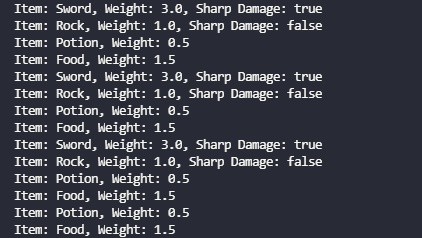
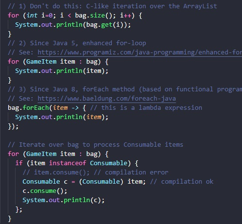
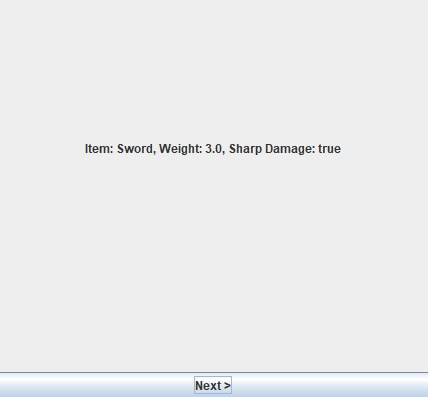
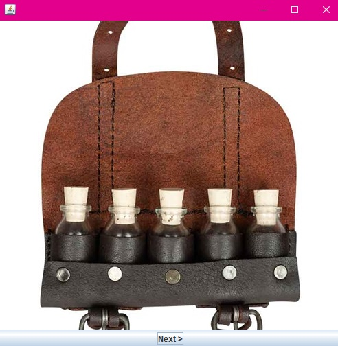
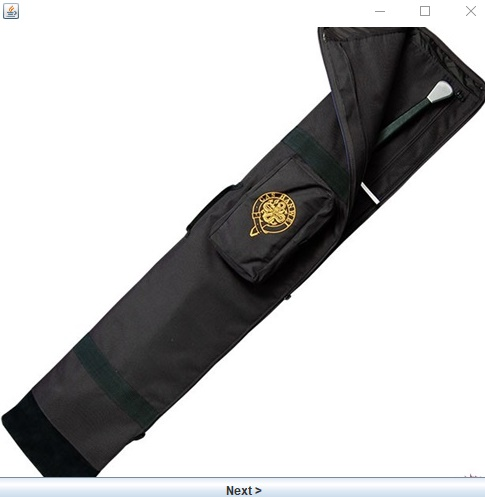

## Exercícios CLI (Command Line Interface)  
1.Compile o código e execute a classe GameItemTestCLI. Entregue uma imagem que registre este momento emocionante!  

2.Observe que o método main dessa classe cria uma coleção de objetos e implementa diferentes formas de iterar sobre eles (veja comentários no código). Entregue um recorte de código desta parte.  

3.Observe que, para objetos Consumable, não são mostrados todos os atributos nos println. Altere o código em Consumable.java para mostrar o restante dos atributos. Entregue os trechos de código alterados e uma explicação sobre eles.  
*Foi criado um metodo para retornar tambem um print da string useTo.*  
`public String toString() {
    return super.toString() + " " + useTo;
 }`

 4.Em GameItemTestCLI.java, no último laço, há uma linha comentada que causa erro de compilação. Entregue uma explicação sobre o motivo do erro com base nos conceitos de orientação a objetos.  
 *O método consume() não esta definido para o tipo 'GameItem' e sim para 'Consumable'.*

 5.Ao final de GameItemTestCLI.java, adicione um código equivalente ao último laço do programa, porém usando o método forEach explicado aqui. Entregue o trecho de código adicionado e uma explicação sobre ele.  
*Dentro do laço é feito uma verificação(if) se existe um item dentro da bag. É declarado Consumable como (c) para receber cada item da bag, chamado o metodo c.comsume()  para consumed receber true. É printado cada item.*  
 `bag.forEach(item ->{
      if (item instanceof Consumable) {
        Consumable c = (Consumable) item;
        c.consume();
        System.out.println(c);
      };
    });`

6.Ao final de GameItemTestCLI.java, adicione um código que calcule o peso total da sacola, considerando todos os itens que estão dentro dela. Entregue o trecho de código adicionado e uma explicação sobre ele.  
*È criada a variavel total para guardar a soma dos pesos.*  
`private static double total`  

*É feito um forEach e a cada repetição é feito um get nos pesos e somado a total +=*  
`bag.forEach(item -> { // this is a lambda expression
      total += item.getWeight();
 });
 System.out.println("Peso total: " + total);`  

7.Em Consumable.java, quando o item é consumido, seu peso continua inalterado. Altere o código para zerar o peso do item quando ele for consumido. Atenção ao encapsulamento! Entregue uma explicação sobre as alterações necessárias no código.  
*Depois de comsumido o weight = 0; no metodo construtor.* 

 ## Exercícios GUI (Graphical User Interface)  
 1.Execute a classe GameItemTestGUI e veja o que acontece a cada clique no botão Next. Entregue uma imagem que registre esse momento histórico da sua vida acadêmica!  
 

 2.Confira esta classe linha por linha e compare com a saída observada. Veja que há um trecho de código anotado com Override. O que significa esta anotação e qual sua relação com a programação orientada a objetos?  
 *Serve para sobrescrever um metodo, sem a necessidade de criar outro.*  

 3.Baixe o arquivo helloimage.zip e descompacte-o. No programa HelloImageSwing.java há um exemplo simples que mostra uma imagem (ícone) na interface gráfica. Compile e execute este programa. Entregue uma imagem desta etapa. Cuidado para que o arquivo com a imagem esteja acessível ao método main.  
 

 4.Sua missão agora será alterar o código de GameItemTestGUI.java para setar e mostrar, na interface gráfica, imagens associadas a cada item na sacola. Consulte a documentação de referência do pacote Swing do JDK Java e altere o visual da interface gráfica ao seu gosto! Entregue uma imagem do resultado e um texto contando sua saga para completar a missão!  
 *Foi criado um array de imagens e dpeois adicionadas uma a uma. Foi usado 'ListIterator' para obter a troca das mesmas ao clicar no botão, tambem criado um label para as imagens aparecerem na interface grafica. E a cada clique do botão era chamado um metodo 'public void actionPerformed' para a troca das mesmas.*  
   
 